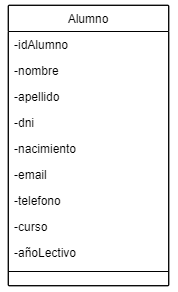
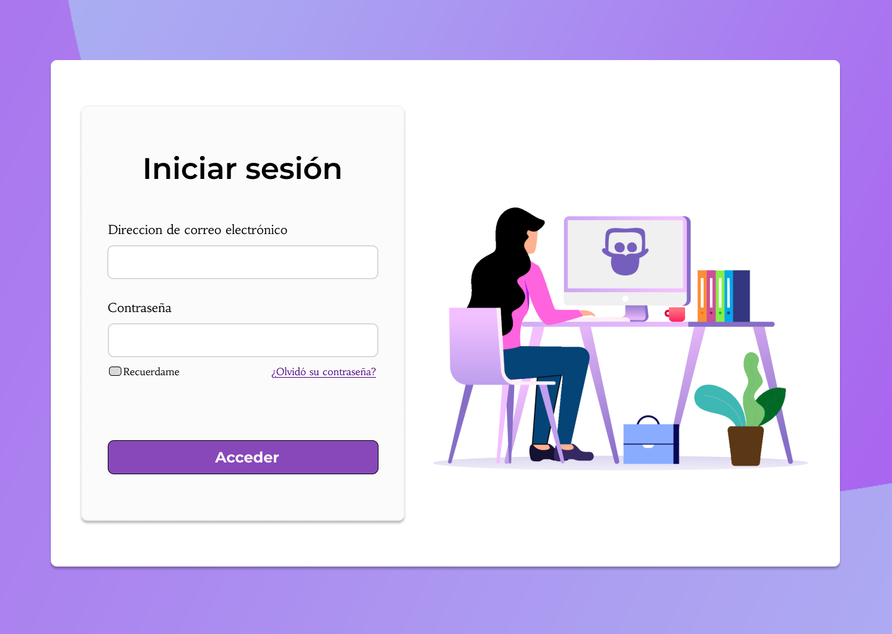
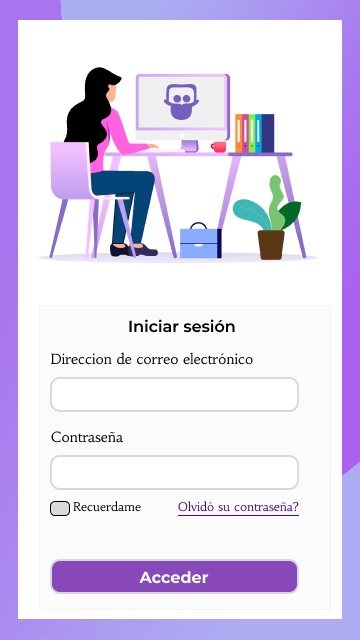
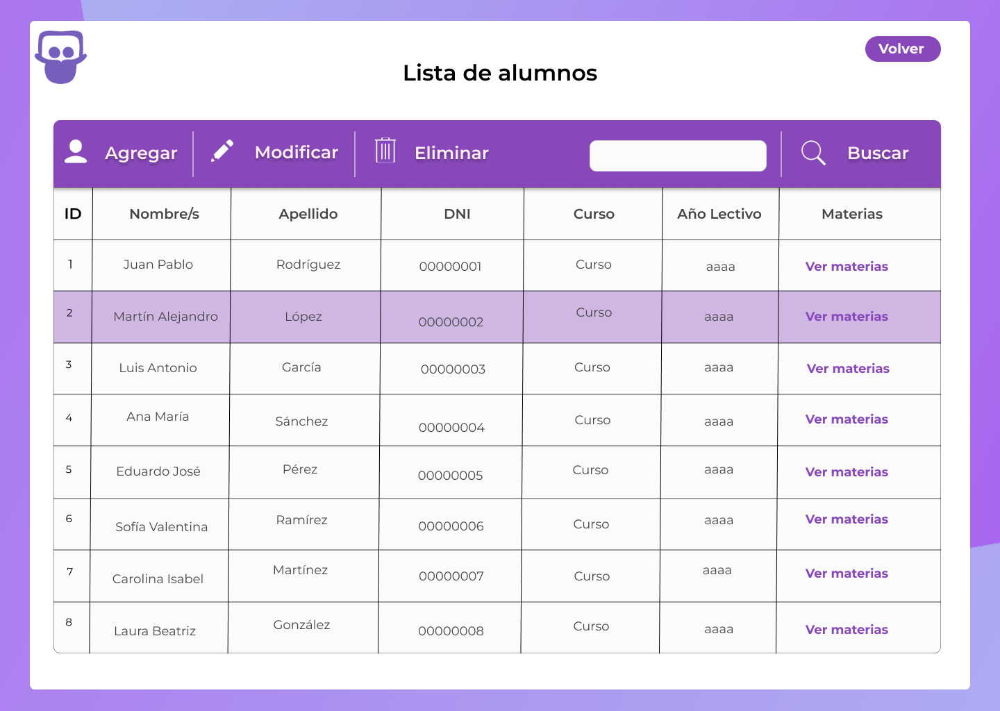
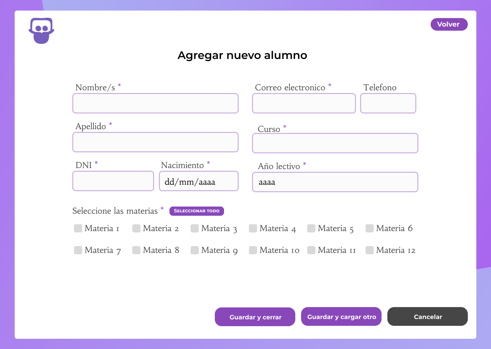
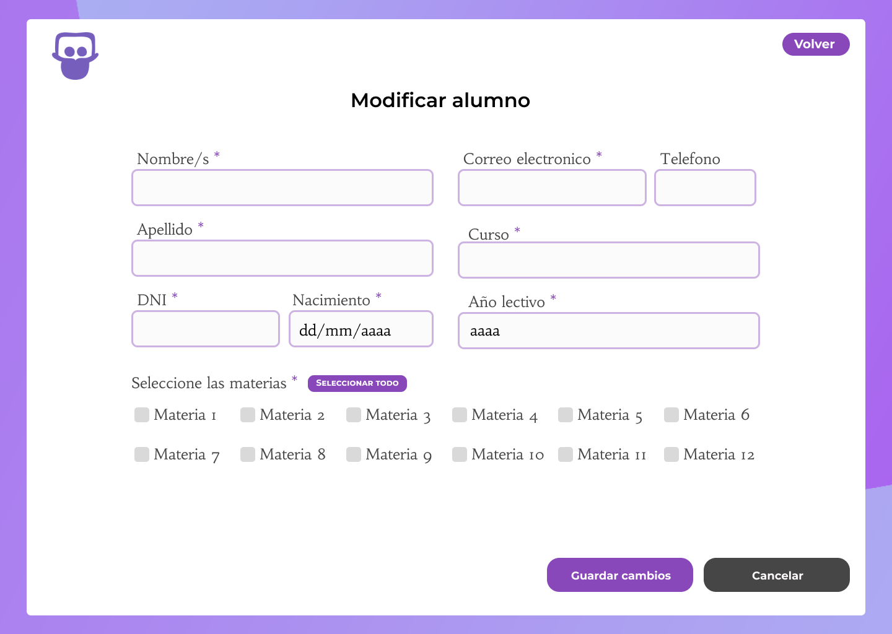
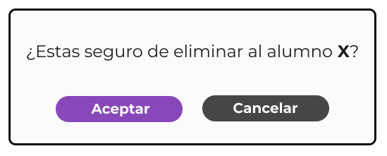

# Documento de diseño y planificación 
Este documento posee el diseño y la planificación tentativa para el desarrollo del sistema a lo largo de la iteración 1.

**Lider de la iteración**: Castellano, Mariano Ezequiel.

## Backlog de iteración
Conforme a lo que respecta la iteración 1, se han elegido las siguientes historias de usuario.

**P4:** 
Como preceptor,  
Quiero poder agregar alumnos al sistema, 
Para mantener un registro actualizado de los estudiantes en el sistema.

**P5:** 
Como preceptor, 
Quiero poder eliminar un alumno del sistema en caso de que se haya cargado incorrectamente, 
Para corregir errores y mantener la precisión de los datos del sistema.

**P6:** 
Como preceptor, 
Quiero poder modificar los datos de los alumnos, 
Para actualizar la información de los estudiantes de manera precisa y oportuna.

Dichas historias de usuario conforman un ABM básico de un alumno. 

## Trabajo en equipo y Tareas
Las tareas, desarrolladas en equipo, se dividen de la siguiente manera, siendo cada columna un miembro del equipo.

1. Saldaña Micaela Soledad.
   - **Implementar la funcionalidad para agregar un alumno al sistema.**
      - Crear la página y el formulario de inicio de sesión.
      - Implementar la lógica para verificar los datos de inicio de sesión en la base de datos. 
      - Crear la página y el formulario para agregar un alumno
      - Implementar la lógica para guardar los datos del alumno en la base de datos.
   - **Ayudar en la implementación de la funcionalidad para modificar un alumno.**
      - Colaborar en la creación del formulario con los datos precargados del alumno.
      - Ayudar en la implementación de la lógica para guardar los cambios en la base de datos.

2. Acuña, Rubén Omar.
   - **Implementar la funcionalidad para modificar un alumno en el sistema.**
      - Crear la lógica para cargar los datos del alumno seleccionado en el formulario de edición.
      - Implementar la lógica para guardar los cambios realizados por el usuario en la base de datos.
   - **Ayudar en la implementación de la funcionalidad para eliminar un alumno.**
      - Colaborar en la creación del modal de confirmación para eliminar un alumno.
      - Ayudar en la implementación de la lógica para eliminar los datos del alumno de la base de datos.

3. Dos Santos, Lucas Emanuel.
   - **Implementar la funcionalidad para eliminar un alumno del sistema.**
      - Crear el modal de confirmación para eliminar un alumno.
      - Implementar la lógica para eliminar los datos del alumno de la base de datos. 
   - **Ayudar en la implementación de la funcionalidad para modificar un alumno.**
      - Colaborar con el equipo en el diseño de las páginas y formularios.
      - Implementar mejoras visuales y de usabilidad en la interfaz de usuario según sea necesario.

## Diseño OO

## WireFrame

- Iniciar sesión Escritorio  

- Iniciar sesión Movil  

- Lista de alumnos

- Agregar Alumno  

- Modificar Alumno  

- Eliminar Alumno  

## Casos de Uso

1. Agregar un alumno
    - El usuario visita la página web y este le pedirá inicie sesión.
    - El sistema lo redirecciona a la pantalla apropiada.
    - El usuario hace clic en el botón "Agregar". 
    - El sistema redirecciona a un formulario tipo con los datos necesarios para un alumno.
    - El usuario completa los campos requeridos en el formulario desplegado y hace clic en "Guardar y cerrar" o "Guardar y cargar otro".
    - El sistema actualiza la página para que el nuevo alumno se vea reflejada en el listado.

2. Modificar un alumno
    - El usuario, en la sección de alumnos, hace clic en el botón "Editar".
    - El sistema redirecciona a un formulario con los datos precargados del alumno elegido.
    - El usuario modifica los campos que cree apropiados modificar y hace clic en el botón "Guardar cambios"
    - El sistema modifica los datos en la base de datos y actualiza la página para reflejar los datos modificados en el listado.

3. Eliminar un alumno
    - El usuario, en la sección de alumnos, hace clic en el botón de "Eliminar".
    - El sistema despliega un modal a modo de confirmación indicando en un mensaje si se está seguro de eliminar al alumno.
    - El usuario hace clic en el botón "Aceptar". 
    - El sistema esconde el modal, elimina los datos en la base de datos y actualiza la página para reflejar los datos modificados en el listado.

    

