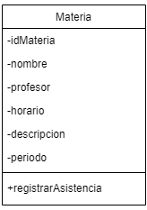
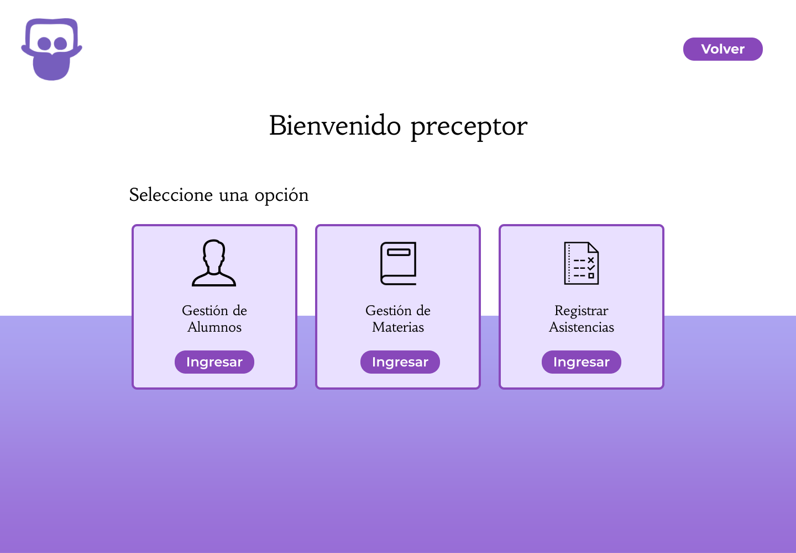
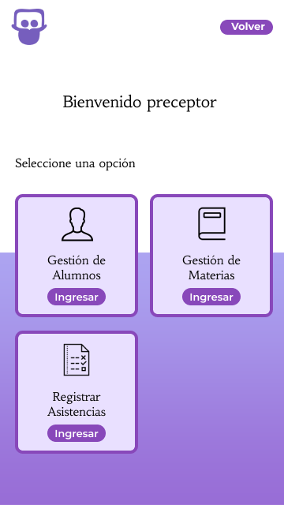
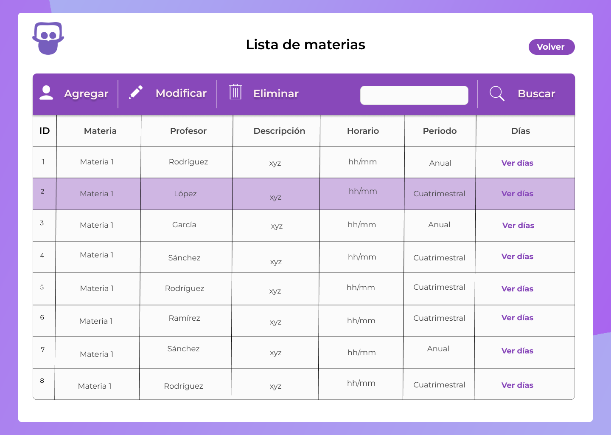
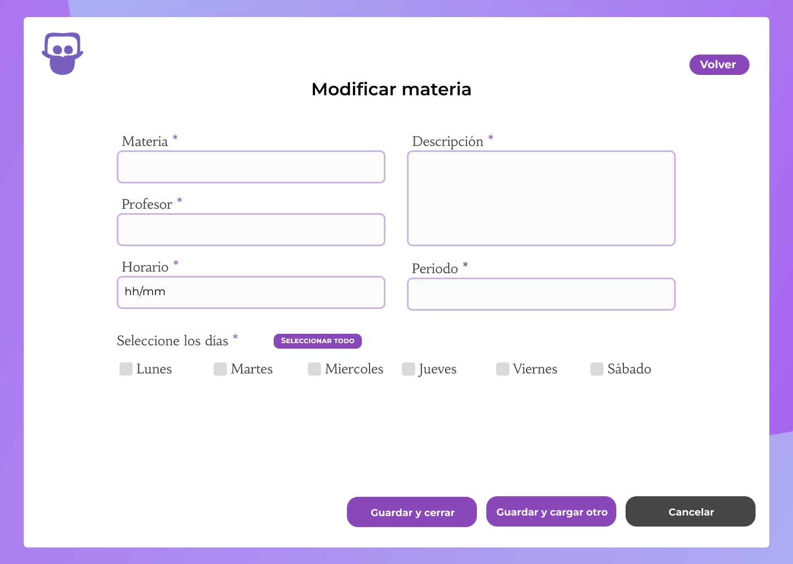

# Documento de diseño y planificación 
Este documento posee el diseño y la planificación tentativa para el desarrollo del sistema a lo largo de la iteración 2.

**Lider de la iteración**: Saldaña, Micaela Soledad.

## Backlog de iteración
Conforme a lo que respecta la iteración 2, se han elegido las siguientes historias de usuario.

**P8:** 
Como preceptor, 
Quiero poder agregar materias al sistema, 
Para tener un registro de las asignaturas que se ofrecen en la institución.

**P9:** 
Como preceptor, 
Quiero poder eliminar una materia del sistema en caso de que se haya cargado incorrectamente, 
Para corregir errores y mantener la precisión de los datos del sistema de materias.

**P10:** 
Como preceptor, 
Quiero poder modificar los datos de las materias, 
Para actualizar la información de las asignaturas de manera precisa y oportuna.

Dichas historias de usuario conforman un ABM básico de una materia. 

## Trabajo en equipo y Tareas
Las tareas, desarrolladas en equipo, se dividen de la siguiente manera.

1. Saldaña Micaela Soledad.
   - **Implementar la funcionalidad para agregar una materia al sistema.**
      - Crear la página de inicio tras haber iniciado sesión.
      - Crear la página y el formulario para agregar una materia.
      - Implementar la lógica para guardar los datos de la materia en la base de datos.
   - **Ayudar en la implementación de la funcionalidad para modificar una materia.**
      - Colaborar en la creación del formulario con los datos precargados de la materia.
      - Ayudar en la implementación de la lógica para guardar los cambios en la base de datos.

2. Acuña, Rubén Omar.
   - **Implementar la funcionalidad para modificar una materia en el sistema.**
      - Crear la lógica para cargar los datos de la materia seleccionado en el formulario de edición.
      - Implementar la lógica para guardar los cambios realizados por el usuario en la base de datos.
   - **Ayudar en la implementación de la funcionalidad para eliminar una materia.**
      - Colaborar en la creación del modal de confirmación para eliminar una materia.
      - Ayudar en la implementación de la lógica para eliminar los datos de la materia de la base de datos.

3. Dos Santos, Lucas Emanuel.
   - **Implementar la funcionalidad para eliminar una materia del sistema.**
      - Crear el modal de confirmación para eliminar una materia.
      - Implementar la lógica para eliminar los datos de la materia de la base de datos. 
   - **Ayudar en la implementación de la funcionalidad para modificar una materia.**
      - Colaborar con el equipo en el diseño de las páginas y formularios.
      - Implementar mejoras visuales y de usabilidad en la interfaz de usuario según sea necesario.

## Diseño OO

## WireFrame

- Inicio Escritorio  

- Inicio Movil  

- Lista de materias

- Agregar Materia  

- Modificar Materia  

- Eliminar Materia  

## Casos de Uso

1. Agregar un materia
    - El usuario visita la página web y este le pedirá inicie sesión.
    - El sistema lo redirecciona a la pantalla apropiada.
    - El usuario deberá seleccionar "Gestión de materias"
    - El sistema lo redirecciona al la pantalla seleccionada.
    - El usuario hace clic en el botón "Agregar". 
    - El sistema redirecciona a un formulario tipo con los datos necesarios para una materia.
    - El usuario completa los campos requeridos en el formulario desplegado y hace clic en "Guardar y cerrar" o "Guardar y cargar otro".
    - El sistema actualiza la página para que la nueva materia se vea reflejada en el listado.

2. Modificar una materia
    - El usuario, en la sección de materias, hace clic en el botón "Editar".
    - El sistema redirecciona a un formulario con los datos precargados de la materia elegida.
    - El usuario modifica los campos que cree apropiados modificar y hace clic en el botón "Guardar cambios"
    - El sistema modifica los datos en la base de datos y actualiza la página para reflejar los datos modificados en el listado.

3. Eliminar una materia
    - El usuario, en la sección de materias, hace clic en el botón de "Eliminar".
    - El sistema despliega un modal a modo de confirmación indicando en un mensaje si se está seguro de eliminar a la materia.
    - El usuario hace clic en el botón "Aceptar". 
    - El sistema esconde el modal, elimina los datos en la base de datos y actualiza la página para reflejar los datos modificados en el listado.

    

