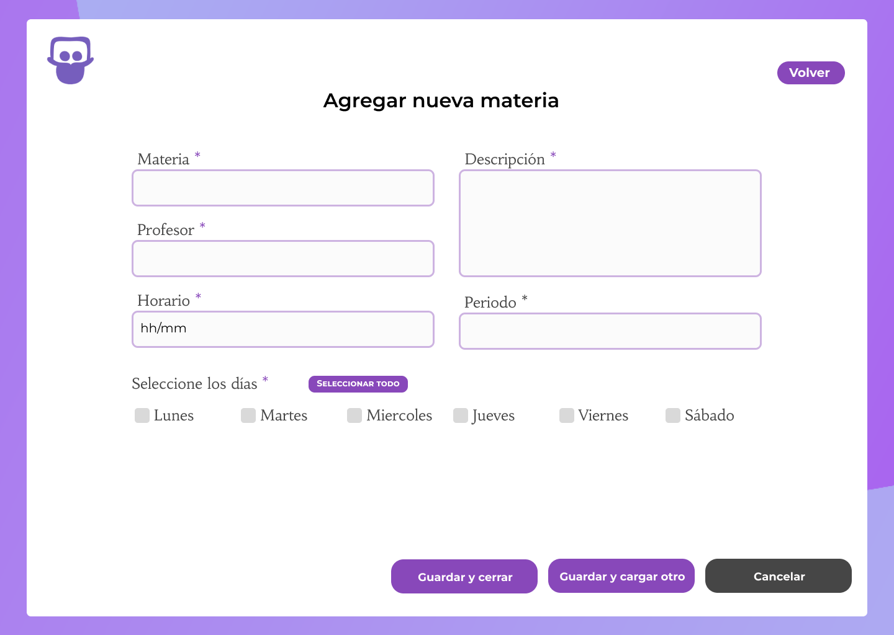

# Documento de diseño y planificación 
Este documento posee el diseño y la planificación tentativa para el desarrollo del sistema a lo largo de la iteración 2.

**Lider de la iteración**: Dos Santos Lucas Emanuel.

## Backlog de iteración
Conforme a lo que respecta la iteración 2, se han elegido las siguientes historias de usuario.

**P1**: Como preceptor, quiero poder agregar materias al sistema.   
**P2**: Como preceptor, quiero poder eliminar una materia del sistema en caso de que se haya cargado incorrectamente.  
**P3**: Como preceptor, quiero poder modificar los datos de las materias.  

Dichas historias de usuario conforman un ABM básico de una materia. 

## Diseño OO

## WireFrame

- Inicio Escritorio  

- Inicio Movil  

- Lista de materias

- Agregar Materia  

- Modificar Materia  

- Eliminar Materia  

## Casos de Uso

1. Agregar un materia
    - El usuario visita la página web y este le pedirá inicie sesión.
    - El sistema lo redirecciona a la pantalla apropiada.
    - El usuario deberá seleccionar "Gestión de materias"
    - El sistema lo redirecciona al la pantalla seleccionada.
    - El usuario hace clic en el botón "Agregar". 
    - El sistema redirecciona a un formulario tipo con los datos necesarios para una materia.
    - El usuario completa los campos requeridos en el formulario desplegado y hace clic en "Guardar y cerrar" o "Guardar y cargar otro".
    - El sistema actualiza la página para que la nueva materia se vea reflejada en el listado.

2. Modificar una materia
    - El usuario, en la sección de materias, hace clic en el botón "Editar".
    - El sistema redirecciona a un formulario con los datos precargados de la materia elegida.
    - El usuario modifica los campos que cree apropiados modificar y hace clic en el botón "Guardar cambios"
    - El sistema modifica los datos en la base de datos y actualiza la página para reflejar los datos modificados en el listado.

3. Eliminar una materia
    - El usuario, en la sección de materias, hace clic en el botón de "Eliminar".
    - El sistema despliega un modal a modo de confirmación indicando en un mensaje si se está seguro de eliminar a la materia.
    - El usuario hace clic en el botón "Aceptar". 
    - El sistema esconde el modal, elimina los datos en la base de datos y actualiza la página para reflejar los datos modificados en el listado.

    

