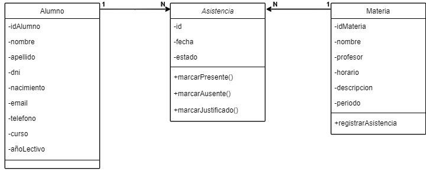
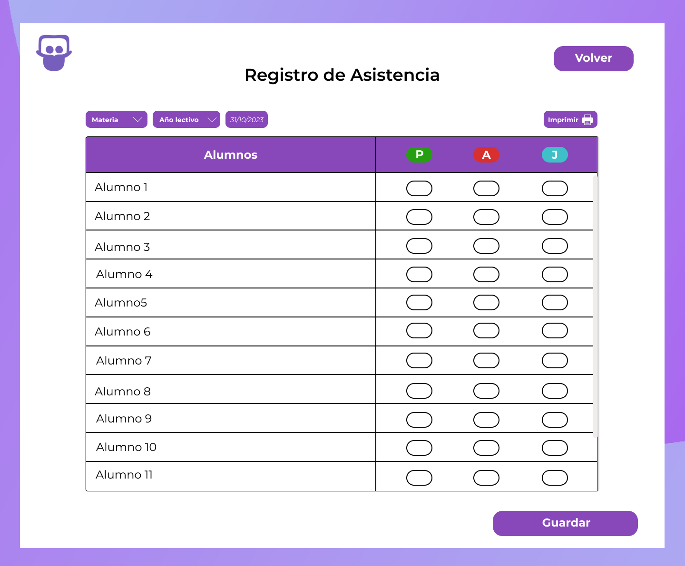
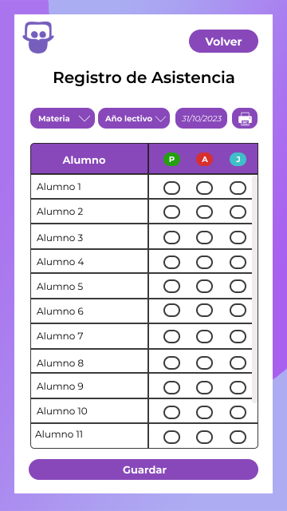

# Documento de diseño y planificación 
Este documento posee el diseño y la planificación tentativa para el desarrollo del sistema a lo largo de la iteración 3.

**Lider de la iteración**: Acuña, Rubén Omar.

## Backlog de iteración
Conforme a lo que respecta la iteración 3, se han elegido las siguientes historias de usuario.

- **P1**: Como preceptor, quiero poder registrar la asistencia de los alumnos de acuerdo a su materia.  
- **P2**: Como preceptor, quiero poder registrar la ausencia de los alumnos de acuerdo a su materia.  
- **P3**: Como preceptor, quiero poder registrar la ausencia justificada de los alumnos de acuerdo a su materia.  
- **P7**: Como preceptor, quiero poder imprimir el listado de asistencia.  

Dichas historias de usuario conforman un lo que sería gestor de asistencia. 

1. Acuña, Rubén Omar.
   - **Implementar la funcionalidad para registrar la asistencia de los alumnos.**
      - Crear la página y el formulario para registrar la asistencia.
      - Implementar la lógica para cargar la lista de materias y años lectivos desde la base de datos.
      - Implementar la lógica para cargar el listado de alumnos matriculados en la materia y año lectivo seleccionados.
      - Implementar la lógica para permitir al usuario marcar los alumnos como presentes, ausentes y ausentes justificados.
      - Implementar la lógica para guardar los datos de asistencia en la base de datos cuando el usuario hace clic en "Guardar".
      - Implementar función de limpiar el formulario después de guardar los datos.
   - **Ayudar en la implementación de la funcionalidad para imprimir el listado de asistencia.**
      - Colaborar en la creación de la lógica para generar el registro de asistencia actual.
      - Implementar la lógica para imprimir el registro de asistencia.

2. Dos Santos, Lucas Emanuel.
   - **Implementar la funcionalidad para cargar la lista de materias y años lectivos.**
      - Crear la lógica para cargar las materias registradas en el sistema en la lista desplegable.
      - Crear la lógica para cargar los años lectivos en la lista desplegable.
   - **Ayudar en la implementación de la funcionalidad para registrar la asistencia.**
      - Colaborar en la creación del formulario para seleccionar la materia, año lectivo y marcar la asistencia de los alumnos.
      - Colaborar en la implementación de la lógica para marcar a los alumnos como presentes, ausentes y ausentes justificados.

3. Saldaña, Micaela Soledad.
   - **Implementar la funcionalidad para cargar el listado de alumnos matriculados en la materia y año lectivo seleccionados.**
      - Crear la lógica para cargar el listado de alumnos matriculados en la materia y año lectivo seleccionados por el usuario.
   - **Revisar y mejorar la interfaz de usuario.**
      - Colaborar con el equipo en el diseño de las páginas y formularios para el registro de asistencia.
      - Implementar mejoras visuales y de usabilidad en la interfaz de usuario según sea necesario para facilitar el proceso de registro de asistencia.

## Diseño OO

## WireFrame

- Asistencias Escritorio  

- Asistencias Movil  

## Casos de Uso

1. Registrar Asistencia
    - El usuario visita la página web y se dirige a la sección de "Registrar Asistencia".
    - El sistema lo redirecciona a la pantalla apropiada.
    - El usuario hace clic en la lista desplegable "Materia". 
    - El sistema despliega la lista de materias registradas en el sistema.
    - El usuario selecciona la materia correspondiente.
    - El sistema carga el listado de alumnos matriculados en la materia seleccionada.
    - El usuario hace clic en la lista desplegable "Año". 
    - El sistema despliega la lista de los años lectivos.
    - El usuario selecciona el año lectivo.
    - El usuario hace click en los "alumnos presentes".
    - El usuario hace click en los "alumnos ausentes".
    - El usuario hace click en los "alumnos ausentes justificados".
    - El usuario hace click en el boton "Guardar".
    - El sistema envía los datos y limpia el formulario.
  
2. Imprimir Asistencia
    - El usuario visita la página web y se dirige a la sección de "Registrar Asistencia".
    - El sistema lo redirecciona a la pantalla apropiada.
    - El usuario hace clic en la lista desplegable "Materia". 
    - El sistema despliega la lista de materias registradas en el sistema.
    - El usuario selecciona la materia correspondiente.
    - El sistema carga el listado de alumnos matriculados en la materia seleccionada.
    - El usuario hace clic en la lista desplegable "Año". 
    - El sistema despliega la lista de los años lectivos.
    - El usuario selecciona el año lectivo.
    - El sistema imprime el registro de asistencia actual.

